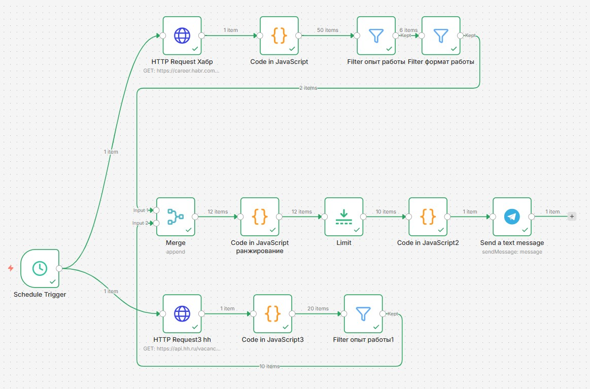

# Бот для мониторинга вакансий


> Автоматический помощник в поиске работы: собирает вакансии, фильтрует шум и присылает дайджест в Telegram

## Зачем этот проект

Пет‑проект, который демонстрирует навык **проектирования ассистентов/ботов** и автоматизации:

- **Собирает** вакансии из нескольких источников
- **Фильтрует** по ключевым критериям (опыт, формат, сфера)
- **Ранжирует** по релевантности (AI, no-code, автоматизация — в приоритете)
- **Отправляет** топ-5 в Telegram каждый день
- **Сохраняет** в Obsidian для дальнейшей работы

## Pitch

Я разработал **систему автоматизации мониторинга вакансий** как пет-проект под карьерный трек. Она решает практическую задачу: исключить ручной просмотр сотен вакансий и получать только самые релевантные предложения.

**Техническая архитектура:**

- **Оркестрация:** n8n (low-code платформа автоматизации)
- **Инфраструктура:** Docker-контейнеризация, локальный деплой
- **CI/CD:** GitHub (версионирование, управление релизами)
- **Интеграции:** HH.ru API, RSS (Хабр Карьера), Telegram Bot API

**Логика обработки данных:**

1. Параллельный сбор вакансий из двух источников (HH + Хабр)
2. Многоступенчатая фильтрация: по опыту (junior/стажёр/помощник), формату работы (удалённо/гибрид/Москва)
3. Взвешенное ранжирование с приоритетом на AI, no-code, автоматизацию (+3 балла в названии, +1 в описании)
4. Дайджест топ-5 в Telegram с указанием источника и рейтинга

В отличие от классических подходов, я использовал **low‑code платформу n8n**, что позволило:

- быстро собрать рабочий прототип
- визуально видеть всю логику отбора вакансий
- легко добавлять новые источники и менять правила фильтрации

**Результат:** Ежедневно в 9 утра я получаю Telegram-сообщение с 5 самыми подходящими вакансиями. Система работает автономно в Docker-контейнере.

**Дальнейшие планы:** добавить сохранение вакансий в Obsidian (база знаний), подключить дополнительные источники (Telegram‑каналы) и развернуть бота на VPS для 24/7 работы.

## Структура репозитория

```text
career-bot/
├── docs/                 # Скриншоты и документация
├── README.md             # Общее описание проекта (вы здесь)
├── LICENSE               # Лицензия MIT
├── v1-python/            # Прототип на Python (hh → Obsidian)
├── v2-n8n/               # Рабочая версия на n8n (hh + Хабр → Telegram)
│   ├── INSTALL.md        # Техническая инструкция по запуску
│   ├── workflow/         # Экспортированный workflow n8n
│   ├── docker/           # Docker-конфигурация
│   └── .gitignore        # Исключения для Docker и БД
└── .gitignore            # Общие исключения репозитория
```


## Версии проекта

Проект развивался, и я реализовал его двумя разными способами,  чтобы освоить разные подходы; **от скрипта на Python до полноценной Low-code системы в Docker. Это позволило ускорить разработку и упростить мониторинг процессов»:**

| Версия        | Технологии                     | Что умеет                       | Статус                                 | Ссылка                              |
| ------------- | ------------------------------ | ------------------------------- | -------------------------------------- | ----------------------------------- |
| **v1-python** | Python, HH API, Telebot        | Сбор с HH → Obsidian → Telegram | ⚠️Прототип (разработка приостановлена) | [Перейти](v1-python/bot/INSTALL.md) |
| **v2-n8n**    | n8n, Docker, RSS, Telegram API | Сбор с HH + Хабр → Telegram     | ✅ Работает                             | [Перейти](v2-n8n/INSTALL.md)        |

#### [Версия 1: Python + HH API](v1-python/README.md) — мой первый опыт и исследование API.

- Полный контроль над логикой
- Глубокая интеграция с Obsidian (создание заметок)
- Telegram-бот с командой `/run`

#### [Версия 2: n8n + Docker](v2-n8n/INSTALL.md) — текущая рабочая версия (рекомендуется к просмотру).

- Визуальное проектирование workflow
- Два источника данных (HH + Хабр Карьера)
- Умное ранжирование (AI, no-code, автоматизация)
- Ежедневный автоматический запуск

## Почему я сделал две версии

**v1-python** — чтобы:
- Освоить работу с API (HH, Telegram)
- Понять, как устроена фильтрация и ранжирование "изнутри"
- Научиться интегрироваться с Obsidian

**v2-n8n** — чтобы:
- Освоить low-code платформы (n8n)
- Понять, как быстро собирать автоматизации
- Научиться работать с Docker и развертыванием


## Как выглядит workflow в n8n




## Как выглядит результат

**Дайджест в Telegram:**

🚀 Дайджест вакансий 20.03.2026

1. Стажер /Бизнес-ассистент/ помощник руководителя  
    🏢 MyHomeYourhome  
    ⭐ Рейтинг: 9  
    📝 стажер /бизнес-ассистент/ помощник руководителя...  
    📌 Источник: HeadHunter  
    🔗 Перейти к вакансии


## Как запустить

#### Для Python-версии
Подробная инструкция в [v1-python/INSTALL](v1-python/bot/INSTALL.md)


#### Для n8n-версии
Подробная инструкция в [v2-n8n/INSTALL](v2-n8n/INSTALL.md)

---

*Этот проект — часть моего карьерного трека "Проект Карьера". Все наработки открыты для демонстрации работодателям.*


